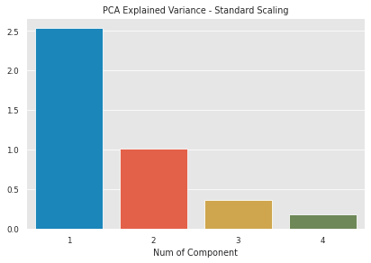
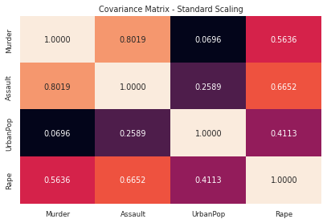
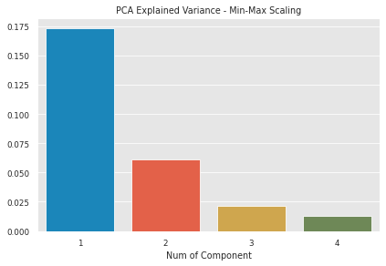
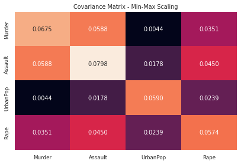
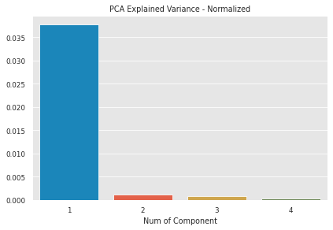
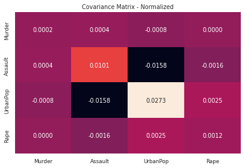

I came up with [this](https://www.reddit.com/r/datascience/comments/x89x48/is_it_normal_that_more_than_90_of_the_pca/?utm_source=share&utm_medium=ios_app&utm_name=iossmf) post on reddit few days ago and it seemed like people separeted in to two about scaling/normalizing the data before applying PCA.

I was interested in the subject and found [this](https://stats.stackexchange.com/questions/69157/why-do-we-need-to-normalize-data-before-principal-component-analysis-pca)

In this post I'm going to examine this. Studied colab notebook file can be found in [here]()

## What is PCA

## Understanding Scaling - Normlizing Methods

## No Preprocess

## Standard Scaling

But why?

## Min Max Scaling

## Normalizing

## Conclusion